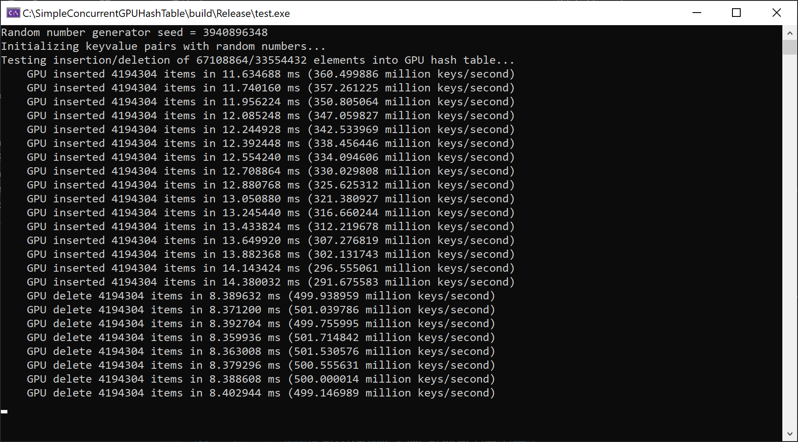

# About

This project shows how to implement a simple hash table running on a GPU. It uses atomic operations to insert key/value
pairs into a hash table on multiple GPU threads using linear probing. It uses CUDA for ease of development, but this can
easily be ported to HLSL or GLSL.

The hash table inserts 32 bit keys and 32 bit values. Deleting from the hash table is not implemented in this simple
example, but it would be simple to implement deletion with tombstones. Similarly, lookups from the hash table are not
implemented in this simple example, but would be a linear search through the table starting at the key's hash.

For more information on lock free hash table design, read Preshing on Programming's [The World's Simplest Lock Free Hash Table](https://preshing.com/20130605/the-worlds-simplest-lock-free-hash-table/).

# Prerequisites

* CMake
* CUDA

This has been tested on Windows with Visual Studio Community 2019 on a machine with an NVIDIA GTX 1060.
An easy way to get CMake is to open a Visual Studio command prompt (in Windows, run "x64 Native Tools Command Prompt for
VS 2019"; that will put CMake in your path).

# Cloning

```
git clone https://github.com/nosferalatu/SimpleConcurrentGPUHashTable.git SimpleConcurrentGPUHashTable
```

# Generating Build Files

Run the following commands to generate .sln and .vcxproj's that can be opened in Visual Studio:

```
cd ConcurrentHashTables
md build
cd build
cmake ..
```

You can now open `SimpleConcurrentGPUHashTable.sln` in Visual Studio.

# Building

You can build within Visual Studio, or from the command line with:

```
cmake --build . --config Release
```

